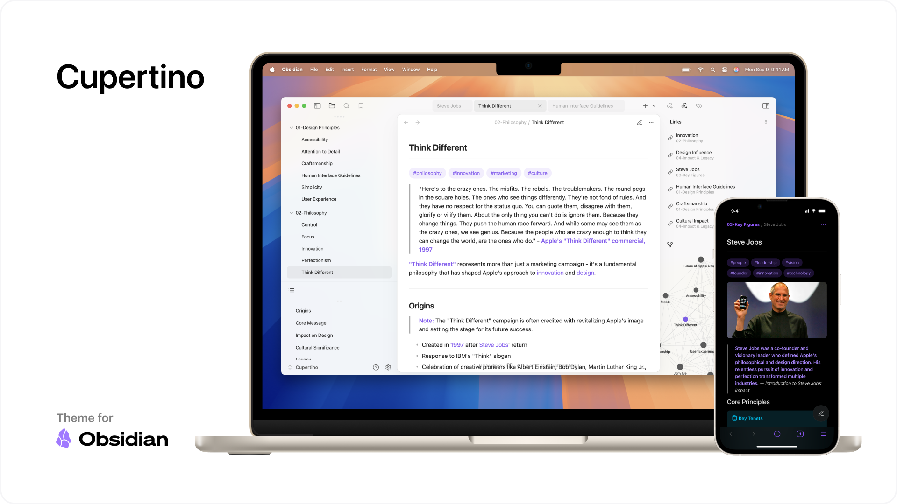

# Cupertino for Obsidian

Cupertino is a theme that brings native experience to Obsidian.

## Features

- **Native experience** — Native look and feel with redesigned modals, menu, search, and more
- **Optimized for mobile** — Completely redesigned mobile experience
- **Comfortable spacing** — Widen spacing across all panels, files, components for better usability
- **Minimal interface** — Auto-hidden tabs & options, new mobile editor header, auto focus mode
- **Windows Mode** — Fluent Design UI for native feeling on Windows
    

> [!NOTE]
> Windows Mode is enabled by default. You can disable it in [Style Settings](https://github.com/mgmeyers/obsidian-style-settings).

## Plugins

All features are enable by default, following plugins can be installed to modify your installation. they are **_not_** required.

### [Style Settings](https://github.com/mgmeyers/obsidian-style-settings)
- Disable auto hiding elements
- Disable active line indicator
- Disable centered status bar
- Disable full width table
- Disable frontmatter foldable heading
- Enable accented window
- Force macOS style on Windows

### [Cupertino Helper](https://github.com/aaaaalexis/obsidian-cupertino-helper/)
- Add pseudo-Mica (wallpaper as background) on Windows
- Fix misaligned window control buttons on macOS

## Philosophy

I’ve spent way too much time on customizing Obsidian, thousands of themes with millions of customizations, I believe a lot people do it too. It’s anti-productivity at this point, we need something that just works and is pleasant to use.

1. You _could_, but you do not _have_ to install any plugin to use Cupertino. — Use plugins to disable features instead of enable. Cupertino works out of the box.
2. The less customizations the better — Cupertino will never have customization. More customization make you waste more time on fiddling.
3. Minimalize visual noise, content is the key. — Obsidian's presence is minimized by blending into system style, so you can focus on what you're typing.

Cupertino is designed as I use Obsidian, while I'm trying to focus on being consistent, inconsistency happens. If you spot any, feel free to submit issues.

## Support

You can follow Cupertino's development or my future work on my [Twitter](https://x.com/cittoj).

[Support me and my work](https://www.buymeacoffee.com/cittoj) so I can keep regular updates and fixes. You’re also welcomed to submit pull requests.

## Credits

- **@colineckert** — [Things 2 (Quick Mode Switcher)](https://github.com/colineckert/obsidian-things)
- **@krios2146** — [Obsidian GitHub Theme (Codeblock Styling)](https://github.com/krios2146/obsidian-theme-github)
- **@FireIsGood** — [Table Rounded Corner](https://forum.obsidian.md/t/60551)
