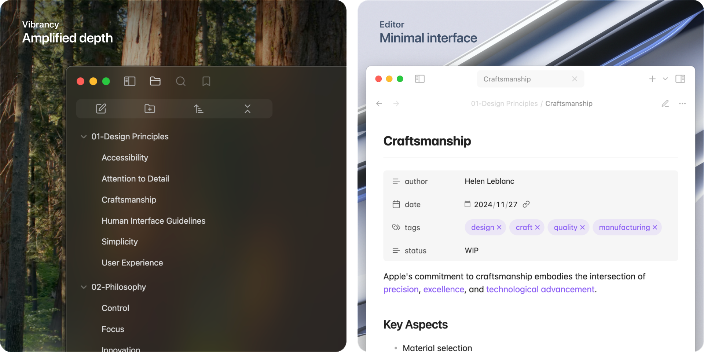
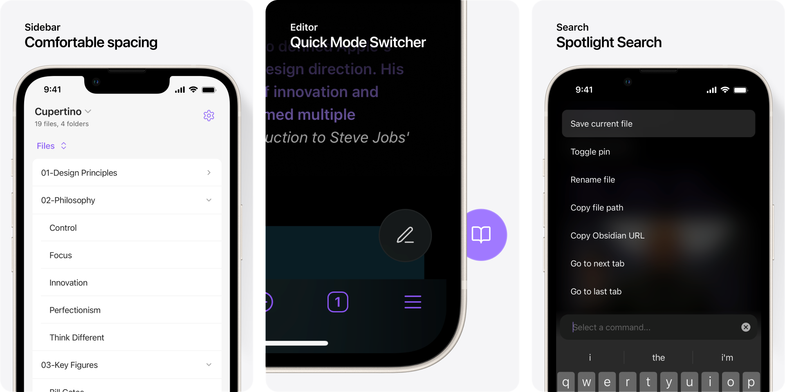
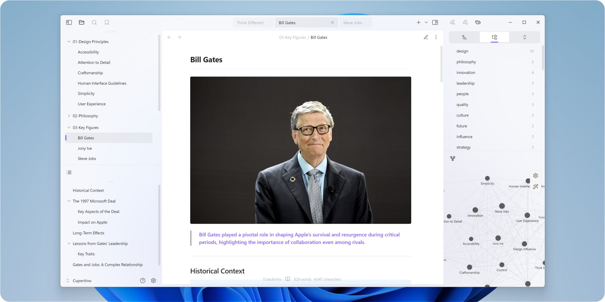

# Cupertino for Obsidian

Cupertino brings native experience to your Obsidian vault.

## Features

- **Native & minimal** — Clean, native look and feel on all of your devices, so you can focus on your content.

  

- **Optimized for mobile** — Redesigned modals, menu, editor, search, and more, with comfortable spacing for usability.

  

- **Windows Mode** — Fluent Design UI for native feeling on Windows (Enabled by default, can be disabled with [Style Settings](https://github.com/mgmeyers/obsidian-style-settings))

  

> [!NOTE]
> Make sure to enable "Translucent window" in Obsidian Appearance settings.

## Plugins

All features are enable by default, following plugins can be installed to modify your installation. they are **_not_** required.

### [Style Settings](https://github.com/mgmeyers/obsidian-style-settings)

- Always show status bar
- Always show tabs count
- Disable active line indicator
- Disable alternative heading style
- Disable auto hiding panel actions
- Disable centered tabs
- Disable full width table
- Disable Quick Mode Switcher
- Disable Windows Mode
- Enable accented window
- Enable compact view
- Enable frontmatter foldable heading

### [Pseudo Mica](https://github.com/aaaaalexis/obsidian-cupertino-helper/) (Windows only)

Adds pseudo-Mica (wallpaper as background) on Windows (Alternatively, wait for Obsidian native support)

## Philosophy

I’ve spent way too much time on customizing Obsidian, thousands of themes with millions of customizations, I believe a lot people do it too. It’s anti-productivity at this point, we need something that just works and is pleasant to use.

1. **Less plugins.** — Plugins are only used for disabling features and fixing issues instead of adding. Cupertino works perfectly out of the box.
2. **Less customizations** — Cupertino will never have customization. More customization make you waste more time on fiddling.
3. **Less visual noise** — Content is the key. Cupertino makes Obsidian blend in system style, so you can focus on what you're typing.

Cupertino is developed as I use Obsidian, while I'm trying to focus on being consistent, inconsistency happens. If you spot any, feel free to submit issues.

## Support

[Support me and my work](https://www.buymeacoffee.com/sevenaxis) so I can keep regular updates and fixes. You’re also welcomed to submit pull requests.

## Credits

- **@mgmeyers** — [California Coast Obsidian Theme](https://github.com/mgmeyers/obsidian-california-coast-theme)
- **@colineckert** — [Things 2 (Quick Mode Switcher)](https://github.com/colineckert/obsidian-things)
- **@krios2146** — [Obsidian GitHub Theme (Codeblock Styling)](https://github.com/krios2146/obsidian-theme-github)
